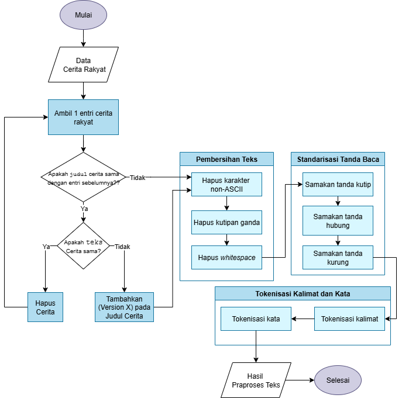

# 📂 Folder `data/`

Folder ini berisi kumpulan data yang digunakan dalam seluruh tahapan pipeline tugas akhir, disusun secara modular berdasarkan urutan proses.

## 📂 Struktur Folder

| No | Folder                                | Deskripsi                                                                 |
|----|---------------------------------------|---------------------------------------------------------------------------|
| 1  | `1_raw/`                              | Cerita rakyat dalam bentuk mentah (paragraf naratif)                      |
| 2  | `2_preprocessed/`                     | Hasil preprocessing teks yang telah dibersihkan dan ditokenisasi         |
| 3  | `3_ner/`                              | Label entitas karakter hasil ekstraksi menggunakan Named Entity Recognition |
| 4  | `4_alias_clustering/`                 | Hasil clustering alias karakter berdasarkan kemiripan dan peran semantik |
| 5  | `5_feature_engineering/`              | Ekstraksi fitur karakter dari kalimat untuk keperluan klasifikasi        |
| 6  | `6_character_type_classification/`    | Dataset pelatihan dan hasil klasifikasi tipe karakter                    |
| 7  | `7_majority_vote_sentence/`           | Output klasifikasi akhir berdasarkan majority voting dari semua kemunculan |

---

## 📄 Penjelasan Tiap Folder

### 📁 `1_raw/`

Berisi 226 cerita rakyat Nusantara dalam format mentah berupa paragraf naratif.  
Dataset ini merupakan hasil scraping dan pengumpulan manual dari berbagai sumber online, mewakili berbagai daerah di Indonesia.

📄 File utama:
- `Dataset Cerita Rakyat.xlsx` – Berisi kumpulan cerita rakyat dalam format spreadsheet, masing-masing terdiri dari judul dan isi narasi.

### 📁 `2_preprocessed/`

Folder ini berisi hasil praproses dari data mentah pada `1_raw/`.  
Data ini telah dibersihkan dan distandarisasi untuk kemudian digunakan dalam proses anotasi entitas karakter dan pelatihan model klasifikasi.

📄 File utama:
- `cerita_rakyat_tokenized_clean.csv` – Berisi cerita rakyat yang telah dibersihkan, distandarisasi, dan ditokenisasi per kalimat.

📊 Ilustrasi alur praproses teks ditampilkan pada gambar berikut:

Output dari tahap ini menjadi fondasi utama untuk tahapan selanjutnya dalam pipeline sistem.

### 📁 `3_ner/`

Folder ini berisi hasil pelabelan entitas karakter menggunakan Named Entity Recognition (NER).

Terdapat dua file utama:

- `ground_truth_ner_bio.csv` – Hasil anotasi manual menggunakan format BIO, digunakan sebagai **label ground truth** untuk pelatihan dan evaluasi.
- `cahyabert_ner.csv` – Hasil prediksi NER terbaik menggunakan model **CahyaBERT**, yang telah dilatih dan diuji pada dataset ini.

Data dari tahap ini digunakan sebagai input untuk proses alias clustering pada tahap berikutnya.

### 📁 `4_alias_clustering/`

Folder ini berisi hasil proses pengelompokan alias (alias clustering) untuk menyatukan berbagai penyebutan karakter yang merujuk ke entitas yang sama.  
Contoh: "Putri", "Sang Putri", dan "Putri Ayu" akan digabung sebagai satu entitas karakter.

Terdapat tiga file utama:

- `ground_truth_karakter.csv` – Hasil pelabelan manual karakter dan penyatuannya sebagai **ground truth** untuk evaluasi hasil clustering.
- `string_similarity.csv` – Hasil clustering berbasis **string similarity** terbaik yaitu menggunakan metode Jaro-Winkler dengan threshold 0,85.
- `string_similarity_with_wsm.csv` – Hasil clustering **gabungan antara string similarity dan word sense mapping (WSM)** untuk meningkatkan ketepatan penyatuan alias.

Data dari tahap ini menjadi dasar untuk membentuk identitas karakter unik sebelum proses klasifikasi tipe karakter dilakukan.

### 📁 `5_feature_engineering/`
Folder ini berisi satu file `alias_sentence_features_sorted_final.csv` yang merupakan hasil penggabungan data teks dengan hasil alias clustering sebelumnya.

File ini telah dilengkapi dengan berbagai fitur karakter yang akan digunakan sebagai input untuk proses klasifikasi tipe karakter pada tahap berikutnya.

### 📁 `6_character_type_classification/`

Folder ini berisi dataset akhir dan hasil klasifikasi tipe karakter, yaitu *protagonis*, *antagonis*, atau *lainnya*.

Pendekatan dibagi menjadi dua level:

#### 📌 Sentence-level
- Mengklasifikasikan karakter berdasarkan kemunculannya dalam setiap kalimat.
- Folder `sentence_level/` berisi:
  - `ground_truth_sentence_level.csv`
  - Hasil prediksi dari pendekatan **deep learning (dl)**, **lexicon-based (lexicon)**, dan **machine learning klasik (ml)**.
  - Setiap pendekatan hanya menyimpan hasil dari **model terbaik**.

#### 📌 Character-level
- Mengklasifikasikan tipe karakter berdasarkan agregasi seluruh kalimat tempat ia muncul.
- Folder `character_level/` berisi:
  - `ground_truth_character_level.csv`
  - Hasil prediksi dari pendekatan **deep learning (dl)**, **lexicon-based (lexicon)**, dan **machine learning klasik (ml)**.
  - Sama seperti sentence-level, setiap pendekatan hanya menyimpan hasil akhir dari **model terbaik**.

Data dari tahap ini akan digunakan untuk proses post-processing dan majority voting pada tahap selanjutnya.

### 📁 `7_majority_vote_sentence/`

Folder ini berisi hasil akhir klasifikasi tipe karakter berdasarkan seluruh kemunculannya dalam kalimat, menggunakan mekanisme **majority voting** untuk menentukan peran karakter secara agregat.

Terdapat dua file utama:

- `ground_truth_sentence_level.csv` – Label tipe karakter hasil anotasi manual berdasarkan kalimat-kalimat yang relevan.
- `final_predicted_with_aliases_indo.csv` – Hasil prediksi akhir tipe karakter berdasarkan majority voting, menggunakan model terbaik yaitu **Random Forest Normalized**, yang mencapai F1-score tertinggi pada evaluasi akhir.

Data ini merupakan hasil akhir dari seluruh pipeline klasifikasi dan digunakan sebagai output utama aplikasi.
